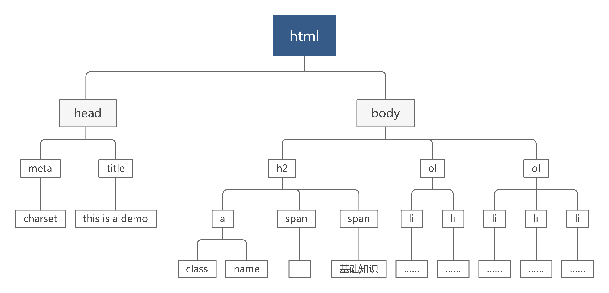

# Python 爬虫——基础知识


**reference**：

- [知乎——如何学习爬虫[入门篇]](https://zhuanlan.zhihu.com/p/21479334)
- [python3 网络爬虫开发实战](https://cuiqingcai.com/5052.html)
- [Python2 爬虫学习系列教程](https://cuiqingcai.com/1052.html)


## 	基础知识

1. python语法
2. 网页相关
   1. 网页信息的呈现
   2. 网页信息的产生
   3. 提取网页信息


## 	[HTTP 基本原理	](https://cuiqingcai.com/5465.html)

- URI、URL和URN

  - URI：Uniform Resorce Identifier（统一资源标志）

    ​	其中包括了URL和URN

  - URL：Universal Resorce Locator（统一资源定位）

    ​	可以联想文件路径

  - URN：Universal Resorce Name（统一资源名称）

    ​	仅仅指定名称，但不标识路径；例如 ISBN码。

- 超文本——HTML

  - 网页的源代码HTML就可以称作超文本，超文本通过浏览器解析以后就可以生成我们所看到的网页。
  - [HTML简介](#HTML简介)

- **HTTP**和**HTTPS**

  - http和https是指访问资源需要的协议类型，ftp、sftp、smb也都是协议类型。
  - **http**
    - 全称：Hyper Text Transfer Protocol（超文本传输协议）
    - 用于从网络传输超文本到本地浏览器的传送协议。
  - **https**
    - 全称： Hyper Text Transfer Protocol over Secure Socket Layer（超文本传输安全协议）
    - 是http的安全版
    - ==如果要爬取证书不被CA机构信任的，但依然通过https协议传输的网站，就需要设置忽略证书的选项，否则会提示SSL链接错误==。

- **HTTP**请求过程

  - 客户端发送请求
  - 服务器接收请求并返回响应
  - 响应传输会客户端，其中包含源代码等内容
  - 客户端浏览器对其进行解析，将网页呈现出来

- 请求

  | 组成部分                   | 简述                                                         |
  | -------------------------- | ------------------------------------------------------------ |
  | 请求方法（Request Method） | 说明了请求的具体类型；常见的请求方法有**GET**和**POST**两种。 |
  | 请求网址（Request URL）    | 统一资源定位符 URL，它可以唯一确定我们想请求的资源。         |
  | 请求头（Request Headers）  | 用来说明服务器要使用的附加信息，比较重要的信息有 Cookie、Referer、User-Agent 等。 |
  | 请求体（Request Body）     |                                                              |

  - 请求方法：

    | 请求方法 | 描述                                                         |
    | -------- | ------------------------------------------------------------ |
    | GET      | 这种请求方法的参数会包含在URL中，并且参数最多只能由1024字节。 |
    | POST     | 这种请求方法的参数不包含在URL中，而是通过表单传输的方式进行传输包含在请求体中，参数的数据量不限。 |

  - 请求头

    | 内容名称        | 简介                                                         |
    | --------------- | ------------------------------------------------------------ |
    | Accept          | 请求报头域，用于指定客户端可以接收哪些类型的信息。           |
    | Accept-Language | 指定客户端可接受的语言类型。                                 |
    | Accept-Encoding | 指定客户端可接受的内容编码。                                 |
    | Host            | 用于指定请求资源的主机IP和端口号，其内容为请求URL的原始服务器网关的位置。 |
    | Cookie          | 这是网站为了辨别用户进行会话跟踪而存储在用户本地的数据。它的主要功能是维持当前访问会话。例如保持登录状态 |
    | Referer         | 此内容用来标识这个请求是从哪个页面发过来的，服务器可以拿到这一信息并做相应的处理，如作来源统计、防盗链处理等。 |
    | User-Agent      | 简称 UA，它是一个特殊的字符串头，可以使服务器识别客户使用的操作系统及版本、浏览器及版本等信息。==在做爬虫时加上此信息，可以伪装为浏览器；如果不加，很可能会被识别出为爬虫==。 |
    | Content-Type    | 也叫互联网媒体类型（Internet Media Type）或者 **MIME** 类型，在 **HTTP** 协议消息头中，它用来表示具体请求中的媒体类型信息。这一项也可以指定**POST**请求方法中提交的数据类型 |

    请求头是请求的重要组成部分，在写爬虫时，大部分情况下都需要设定请求头。	

  - 请求体

    请求体一般承载的内容是**POST**请求中的表单数据，而对于**GET**请求来说，请求体为空。

    下面列出**Content-Type**与**POST**提交数据类型的关系：

    | Content-Type                      | POST提交数据类型    |
    | --------------------------------- | ------------------- |
    | application/x-www-form-urlencoded | 表单数据            |
    | multipart/form-data               | 表单文件上传        |
    | application/json                  | 序列化**JASON**数据 |
    | text/xml                          | **XML**数据         |

- 响应

  | 组成部分                           | 简述                           |
  | ---------------------------------- | ------------------------------ |
  | 响应状态码（Response Status Code） | 表示服务器的响应状态           |
  | 响应头（Response Headers）         | 包含了服务器对于请求的应答信息 |
  | 响应体（Response Body）            | 响应的正文都在响应体之中       |

  - 响应状态码：

    | 响应状态码 | 含义               | 备注                                                         |
    | ---------- | ------------------ | ------------------------------------------------------------ |
    | 100        | 继续               | 请求者应当继续提出请求。服务器已收到请求的一部分，正在等待其余部分 |
    | 101        | 切换协议           | 请求者已要求服务器切换协议，服务器已确认并准备切换           |
    | 200        | 成功               | 服务器已经成功处理了请求                                     |
    | 201        | 已创建             | 请求成功并且服务器创建了新的资源                             |
    | 202        | 以接受             | 服务器已经接受了请求，但尚未处理                             |
    | 203        | 非授权信息         | 服务器已成功处理了请求，但返回的信息可能来自另一个源         |
    | 204        | 无内容             | 服务器成功处理了请求，但没有返回任何内容                     |
    | 205        | 重置内容           | 服务器成功处理了请求，内容被重置                             |
    | 206        | 部分内容           | 服务器成功处理了部分请求                                     |
    | 300        | 多种选择           | 针对请求，服务器可执行多种操作                               |
    | 301        | 永久移动           | 请求的网页已经永久移动到新的位置，即永远重定向               |
    | 302        | 临时移动           | 请求的网页暂时跳转到其他页面，即临时重定向                   |
    | 303        | 查看其他位置       | 如果原来的请求是**POST**，重定向目标文档应该通过**GET**获取  |
    | 304        | 未修改             | 此次请求返回的网页未修改，继续使用上次的资源                 |
    | 305        | 使用代里           | 请求者应该使用代里访问该网页                                 |
    | 307        | 临时重定向         | 请求资源临时从其他位置响应                                   |
    | 400        | 错误请求           | 服务器无法解析该请求                                         |
    | 401        | 未授权             | 请求没有进行身份验证或身份验证未通过                         |
    | 403        | 禁止访问           | 服务器拒绝此请求                                             |
    | 404        | 未找到             | 服务器禁用了请求中的方法                                     |
    | 406        | 不接受             | 无法使用请求的内容响应请求的网页                             |
    | 407        | 需要代理授权       | 请求者需要使用代理授权                                       |
    | 408        | 请求超时           | 服务器请求超时                                               |
    | 409        | 冲突               | 服务器在完成请求时发生冲突                                   |
    | 410        | 已删除             | 请求的资源已永远删除                                         |
    | 411        | 需要有效长度       | 服务器不接受不含有有效内容长度表头字段的请求                 |
    | 412        | 请求实体过大       | 请求实体过大，超出服务器处理能力                             |
    | 413        | 请求**URL**过长    | 请求网址过长，服务器无法处理                                 |
    | 415        | 不支持类型         | 请求格式不被请求页面支持                                     |
    | 416        | 请求范围不符       | 页面无法提供请求的范围                                       |
    | 417        | 为满足期望值       | 服务器为满足请求标头字段的要求                               |
    | 500        | 服务器内部错误     | 服务器遇到错误，无法完成请求                                 |
    | 501        | 为实现             | 服务器不具备完成请求的功能                                   |
    | 502        | 错误网关           | 服务器作为网关或代理，从上有服务器收到无效响应               |
    | 503        | 服务器不可用       | 服务器目前无法使用                                           |
    | 504        | 网关超时           | 服务器作为代理或网关，但是没有即使从上有服务器收到请求       |
    | 505        | **HTTP**版本不支持 | 服务器不支持请求中所用的**HTTP**版本                         |

  - 响应状头

    | 信息名称         | 简述                                                         |
    | ---------------- | ------------------------------------------------------------ |
    | Date             | 响应产生的时间                                               |
    | Last-Modified    | 指定资源的最后修改时间                                       |
    | Content-Encoding | 指定响应内容的编码                                           |
    | Server           | 包含服务器的信息，比如名称、版本号等                         |
    | Content-Type     | 文档类型，指定返回的数据类型是什么，如 text/html 代表返回 HTML 文档，application/x-javascript 则代表返回 JavaScript 文件，image/jpeg 则代表返回图片 |
    | Set-Cookie       | 设置 Cookies。响应头中的 Set-Cookie 告诉浏览器需要将此内容放在 Cookies 中，下次请求携带 Cookies 请求 |
    | Expires          | 指定响应的过期时间，可以使代理服务器或浏览器将加载的内容更新到缓存中。如果再次访问时，就可以直接从缓存中加载，降低服务器负载，缩短加载时间 |

  - 响应体

    响应体是响应的正文部分，==爬虫请求网页之后要解析的内容就是响应体==。

    在做爬虫时，我们主要通过响应体的到**网页源代码**、**JASON数据**等等，然后从中做相应内容的提取。

  ## HTML简介

- **HTML**代码由包含尖括号的字符组成，这些代码称为**HTML**元素。

- **HTML**元素的组成部分包括一个**开始标签**（就像这样：`<html>`）和一个**结束标签**（就像这样`</html>`）；可以看到，结束标签比开始标签多出了一个`/`。

- 以下是此文档中一些内容的部分**HTML**代码：

```html
<html>
    <head>//用来指定网页的一些配置和引用
        <meta charset="UTF-8"/>//指定了网页的编码为UTF-8
        <title>This is a Demo</title>//网页标题
    </head>
    <body>
		<h2>
            <a class="md-header-anchor" name="基础知识"></a>
            <span>	</span>
            <span>基础知识</span>
        </h2>
  		<ol>
    		<li><p><span>python语法</span></p></li>
    		<li><p><span>网页相关</span></p>
      	<ol>
        	<li><span>网页信息的呈现</span></li>
        	<li><span>网页信息的产生</span></li>
        	<li><span>提取网页信息</span></li>
      	</ol>
    	</li>
  		</ol>
	</body>
</html>
```

以下是运行效果：


- **HTML基本结构**
  - 起始标签`<html>`和结束标签`</html>`之间都是HTML代码
  - 起始标签`<body>`和结束标签`</body>`之间所有的内容将写在浏览器主窗口中
  - `<h1>`和`</h1>`之间的文字是主标题（`<h2>`和`</h2>`之间是子标题，数字越大标题等级越低）
  - 成段的文字会在`<p1>`和`<p2>`之间

- 标签详解

  ```html
  <a class="md-header-anchor" name="基础知识"></a>
  ```

  - 开始标签    `<a class="md-header-anchor" name="基础知识">`
    - 字符：`a`
    - 特性：特性名称（ `class` 和 `name` ） +  特性值（`"md-header-anchor"`和`"基础知识"`）
  - 结束标签    `</a>`

> 处理heml文件需要使用到[正则表达式](#Python 正则表达式)：也就是说，我们需要根据爬取数据的源代码结构编写相应的处理代码，运用正则表达式对源代码进行处理。

- 节点树和节点间的关系

  在 HTML 中，所有标签定义的内容都是节点，它们构成了一个 HTML DOM 树。

  如果我们把之前的示例化成一颗节点树的话，会是这样的：

  

  个人认为，将**HTML**理解成树结构以后更有利于我们对**HTML**文件内容的提取和整理。由于树是一种**递归**的结构，我们在处理**HTML**文件的时候也可以使用递归的函数来对其进行处理。

## [会话和Cookies](https://cuiqingcai.com/5487.html)

会话和**Cookies**用来保持**HTTP**链接状态。会话在服务器端，用来保存用户的会话信息；**Cookies**在客户端，有了**Cookies**，浏览器会在下次访问网站时自动附带上它发给服务器，而服务器则通过**Cookies**来识别用户的身份，做出响应。

**注意：**

关闭浏览器并不会导致服务器删除会话，但关闭浏览器可能会导致**Cookies**的丢失，如果使用某种手法保存**Cookies**，在过一段时间访问时使用某种手段来改写浏览器发送请求的请求头，把原来的**Cookies**发送给服务器，那么服务器仍能够找到原来的会话**ID**，依旧可以保持登陆状态。


## [代理——用于伪装**IP**防止服务器“封IP”](https://cuiqingcai.com/5491.html)

- 基本原理
  - 构建用户和Web服务器之间的桥梁，使用代理服务器而不是本机去访问Web服务器，使得Web服务器无法识别出本机**IP**，达到**IP**伪装的目的。

# Python 正则表达式

[廖雪峰官网Python正则表达式](https://www.liaoxuefeng.com/wiki/1016959663602400/1017639890281664)

- 匹配原则

| 正则表达式字符 | 含义                                                         |
| -------------- | ------------------------------------------------------------ |
| `\d`           | 可以匹配一个任意数字                                         |
| `\w`           | 可以匹配一个任意字幕或数字                                   |
| `.`            | 可以匹配一个任何字符                                         |
| `*`            | 表示任意数量的字符（也包括0个）<br />**例如**：<br />`\d*`可以匹配任意多个数字，<br />`.*`可以匹配任意多个任意字符 |
| `+`            | 表示一个及以上（也就是说不包括0个）                          |
| `?`            | 1. 表示0或一个<br />**例如**：`\d?`表示0或1个数字<br />2. 表示非贪婪匹配（[贪婪匹配和非贪婪匹配](#贪婪匹配)）<br />**例如**：`\d+?`表示非贪婪匹配 |
| `{n}`          | 表示匹配n个字符                                              |
| `{m,n}`        | 表示匹配m到n个字符（不包括n）                                |
| `[]`           | 用来指定匹配范围，一般配合`-`来使用<br />**例如**：<br />`[0-8]`可以匹配数字0到数字8，`[125]`可以匹配数字1、2或5 |
| `|`            | **例如**：`(A|B)`可以匹配字符`A`或`B`                        |
| `^`            | 表示以某字符开头<br />**例如**：`^\d`表示以一个数字开头      |
| `$`            | 表示以某字符结尾<br />**例如**：`\d$`表示以一个数字结尾      |

- re模块
  - python提供了re模块，包含所有者则表达式功能。
  - 使用`r''`来表示正则表达式，**例如**：使用`r'ABC-001'`表示正则字符串 *'ABC-001'*
  - re模块中的方法：

	| 方法                                  | 简介                                                         |
  | ------------------------------------- | ------------------------------------------------------------ |
  | `re.match(regular_expression,string)` | 用正则表达式参数`regular_expression`去匹配字符串参数`string`，如果匹配成功则返回一个`Match`对象作为匹配结果，否则返回`None` |
  | `re.split(regular_expression,string)` | 用正则表达式参数`regular_expression`作为分割表示，去分割字符串参数`string` |

   - 分组：
  
  用`()`表示的就是要提取的分组，例如：`^(\d{3})-(\d{3,8})$`分别定义了两个组，可以直接从匹配的字符串中提取出区号和本地号码：

```python
>>> m = re.match(r'^(\d{3})-(\d{3,8})$', '010-12345')
>>> m
<_sre.SRE_Match object; span=(0, 9), match='010-12345'>
>>> m.group(0)
'010-12345'
>>> m.group(1)
'010'
>>> m.group(2)
'12345'
```

#### 贪婪匹配

贪婪匹配最后需要特别指出的是，正则匹配默认是贪婪匹配，也就是匹配尽可能多的字符。举例如下，匹配出数字后面的`0`：

```python
>>> re.match(r'^(\d+)(0*)$', '102300').groups()
('102300', '')
```
由于`\d+`采用贪婪匹配，直接把后面的`0`全部匹配了，结果`0*`只能匹配空字符串了。必须让`\d+`采用非贪婪匹配（也就是尽可能少匹配），才能把后面的`0`匹配出来，加个`?`就可以让`\d+`采用非贪婪匹配：
```python
>>> re.match(r'^(\d+?)(0*)$', '102300').groups()
('1023', '00')
```