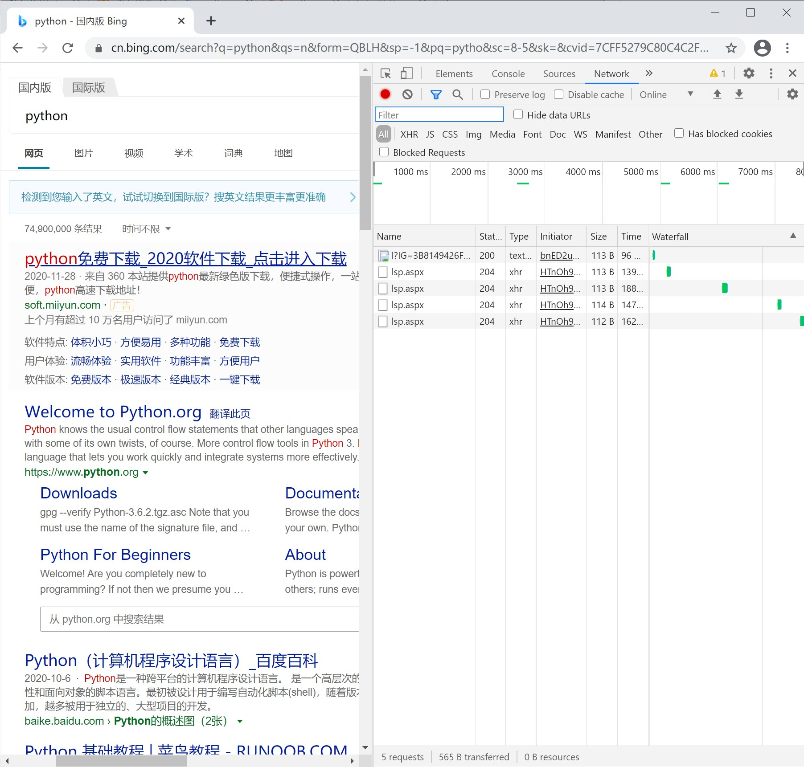
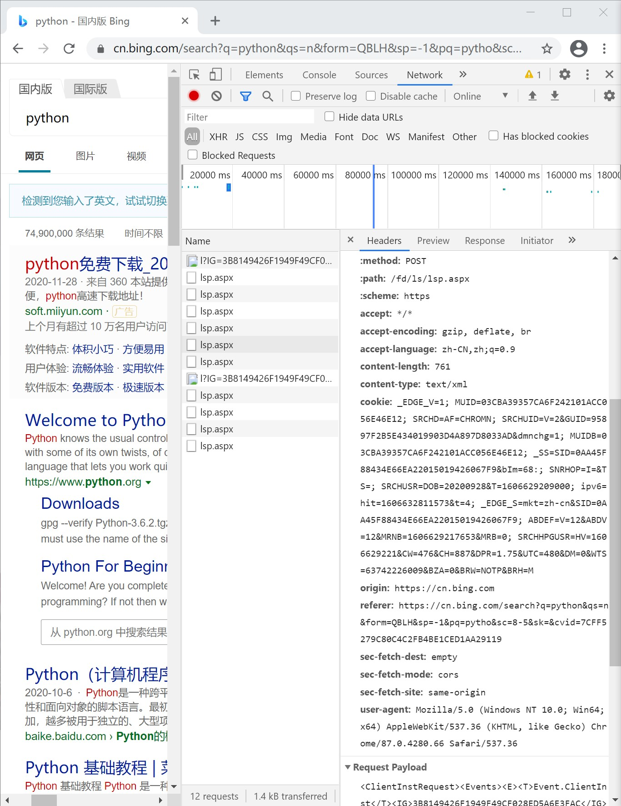
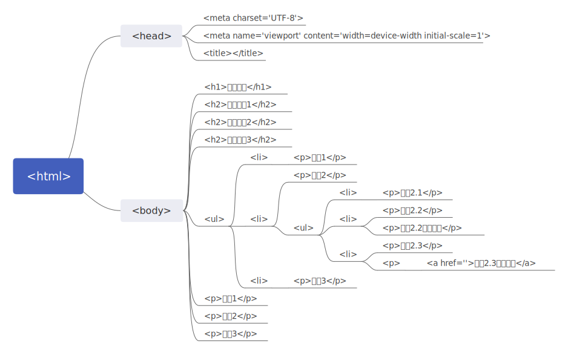

# Python爬虫——基本库的使用

**reference:**

[Python3 网络爬虫开发实战教程 | 静觅 (cuiqingcai.com)](https://cuiqingcai.com/5052.html)

| 库名称         | 简介                                                         | api                                                          |
| -------------- | ------------------------------------------------------------ | ------------------------------------------------------------ |
| urllib         | 是python内置的一个HTTP请求库，不需要额外安装即可使用。       |                                                              |
| requests       | 功能强大，使用方便，**建议直接看这个**（听说安装不是很方便， 可能需要翻墙...） | [官方文档](http://www.python-requests.org/)<br /><br />[中文文档](https://cn.python-requests.org/zh_CN/latest/) |
| Beautiful Soup | 解析网页代码的强大工具                                       | [中文文档](https://beautifulsoup.readthedocs.io/zh_CN/v4.4.0/) |
| chardet        | 强大的编码推测工具                                           | [简介](#chardet库)                                           |


## urllib库


#### 四个模块

| 模块名称      | 模块简介                                                     |
| ------------- | ------------------------------------------------------------ |
| `request`     | 它是最基本的 HTTP 请求模块，可以用来模拟发送请求。就像在浏览器里输入网址然后回车一样，只需要给库方法传入 URL 以及额外的参数，就可以模拟实现这个过程了。 |
| `error`       | 异常处理模块，如果出现请求错误，我们可以捕获这些异常，然后进行重试或其他操作以保证程序不会意外终止。 |
| `parse`       | 一个工具模块，提供了许多 URL 处理方法，比如拆分、解析、合并等。 |
| `robotparser` | 主要是用来识别网站的 robots.txt 文件，然后判断哪些网站可以爬，哪些网站不可以爬，它其实用得比较少。 |

- `request`模块

  - `urlopen()`方法：

    - 方法api：

      ```python
      urllib.request.urlopen(url, data=None, [timeout, ]*, cafile=None, capath=None, cadefault=False, context=None)
      ```

    - 功能：

      完成最基本的简单网页的**GET**请求抓取。

    - 参数介绍：

      | 参数      | 类型                                                         | 含义                                                         |
      | --------- | ------------------------------------------------------------ | ------------------------------------------------------------ |
      | `url`     | 字符串                                                       | 网址（URL）                                                  |
      | `data`    | 字节流（`bytes`）**注意**：可以使用`bytes()`函数将一个`str`类型转化成`bytes`类型。 | 如果选择传入该参数，则`urlopen()`方法发送的请求不再时一个**GET**类型的请求，而是一个**POST**类型的请求，该请求的提交方式为表单提交方式，表单数据中的参数名和参数值由该`data`参数决定。我们可以借助`urllib.parse.urlencode()`方法来以字典形式指定参数名和参数方法。 |
    | `timeout` | 超时时间                                                     | 超时以后会抛出URL Error异常                                  |

*（这个库好像不是特别好用...直接看下一个吧）*

### 解析链接


## requests库


### 安装

使用以下命令安装:

```
pip install requests
```

如果安装失败, 请翻墙...或者尝试其他方式:

[[Python3 网络爬虫开发实战\] 1.2.1-Requests 的安装 | 静觅 (cuiqingcai.com)](https://cuiqingcai.com/5132.html)


### 基本用法

- 发送**GET**请求

  使用`request.get()`来模拟浏览器发送一个**GET**请求. 这个方法的参数和返回值简介如下:

  - `get(url, **kwargs)`[[源代码\]](https://cn.python-requests.org/zh_CN/latest/_modules/requests/sessions.html#Session.get)

    Sends a GET request. Returns [`Response`](https://cn.python-requests.org/zh_CN/latest/api.html#requests.Response) object.

    | 参数:     | **url** -- URL for the new [`Request`](https://cn.python-requests.org/zh_CN/latest/api.html#requests.Request) object. <br />***\*kwargs** -- Optional arguments that `request` takes.(使用字典的形式传入该参数) |
    | :-------- | ------------------------------------------------------------ |
    | 返回类型: | [requests.Response](https://cn.python-requests.org/zh_CN/latest/api.html#requests.Response)类型的对象, 其中储存了从服务器返回的 |

  - 应用举例

    ```python
    import requests
    
    def get_without_keywords():
        # 发送一个简单的GET请求， 不在url中设置参数
        response = requests.get("https://www.gdtv.cn/article/be9dfdbc758ff7adb416760382702aa0")
        print(type(response))
        print(type(response.text))
        print(response.text)
        print(type(response.cookies))
        print(response.cookies)
    ```

    运行结果:

    ```
    C:\Users\13622\AppData\Local\Programs\Python\Python38\python.exe C:/Users/13622/OneDrive/文档/大二上/数据科学基础大作业/FoundationOfDataScience_Assignment/相关知识/reference/code/test_requests/test_get.py
    <class 'requests.models.Response'>
    <class 'str'>
    <!DOCTYPE html>
    <html lang="zh">
    //为了文档的简洁, 省略源代码部分. 
    </html>
    <class 'requests.cookies.RequestsCookieJar'>
    <RequestsCookieJar[]>
    
    Process finished with exit code 0
    
    ```

    事实证明, 有些新闻网站的实际编码与header中标明的不一致. 似乎只要涉及到中文编码, 解析就会出问题。[chardet库](#chardet库)可以帮我们解决这个问题。

    ```python
def get_with_keywords():
        data = {
            'name': 'germey',
            'age': 22
        }
        r = requests.get("http://httpbin.org/get", params=data)  # 这是一个测试网站， 用来返回请求的一些信息，返回的是一个json字符串。
        print(r.text)
    ```
    
    结果:

    ```
{
      "args": {
        "age": "22", 
        "name": "germey"
      }, 
      "headers": {
        "Accept": "*/*", 
        "Accept-Encoding": "gzip, deflate", 
        "Host": "httpbin.org", 
        "User-Agent": "python-requests/2.25.0", 
        "X-Amzn-Trace-Id": "Root=1-5fc30b0f-26d1cf424e2eb98d642afde0"
      }, 
      "origin": "202.119.46.77", 
      "url": "http://httpbin.org/get?name=germey&age=22"
    }
    ```
    
    如果已知是网站返回的是一个json字符串, 可使用以下方法将该字符串解析成一个json字典:

    ```python
print(r.json())
    ```
    
    结果:

    ```python
{'args': {'age': '22', 'name': 'germey'}, 'headers': {'Accept': '*/*', 'Accept-Encoding': 'gzip, deflate', 'Host': 'httpbin.org', 'User-Agent': 'python-requests/2.25.0', 'X-Amzn-Trace-Id': 'Root=1-5fc30be8-443358b47d49d07905d6566a'}, 'origin': '202.119.46.77', 'url': 'http://httpbin.org/get?name=germey&age=22'}
    
    ```
  
- 添加**headers**

  访问某些网站时需要添加请求头中的参数, 可以用以下方法来添加请求头参数:

  ```python
  def get_with_header():
      headers = {
          'User-Agent': 'Mozilla/5.0 (Windows NT 10.0; Win64; x64) AppleWebKit/537.36 (KHTML, like Gecko) Chrome/87.0.4280.67 Safari/537.36 Edg/87.0.664.47'
  
      }
      r = requests.get("https://www.zhihu.com/explore", headers=headers)
      print(r.text)
  ```

  打开浏览器(这里以谷歌浏览器为例), 访问任何一个网站, 按下`ctrl+shift+I `即可打开开发者工具:



选择最上层`Network`一栏, 在下方表格中选择需要的一项点击进入(如果只是要查看请求头中一些常规的参数信息的话, 可以随意选一项进入):



选择`Headers`一栏, 找到`Request Headers`即可查看其中的参数. 

在python代码中, 我们使用字典的形式指定请求头中的参数信息, 然后将其该字典对象传入requests库的方法中即可设置请求头.

- 发送**POST**请求

  使用`requests.post()`方法来发送一条**POST**类型的请求, 方法的api如下:

  ```python
  def post(url, data=None, json=None, **kwargs):
      r"""Sends a POST request.
  
      :param url: URL for the new :class:`Request` object.
      :param data: (optional) Dictionary, list of tuples, bytes, or file-like
          object to send in the body of the :class:`Request`.
      :param json: (optional) json data to send in the body of the :class:`Request`.
      :param \*\*kwargs: Optional arguments that ``request`` takes.
      :return: :class:`Response <Response>` object
      :rtype: requests.Response
      """
  
  
  ```

- 设置Response对象的编码格式：

  ```python
  response.encoding = "utf-8"# 或者其他类型
  ```

  

## Beautiful Soup


### 安装

由于教程推荐安装**lxml**来作为**Beautiful Soup**的解析器, 所以需要安装**lxml**和**Beautiful Soup**两个模块.

- lxml安装

  ```
  pip3 install lxml
  ```

- beautifu soup安装

  ```
  pip install beautifulsoup4
  ```

### 功能简介

>Beautiful Soup 提供一些简单的、Python 式的函数来处理导航、搜索、修改分析树等功能。它是一个工具箱，通过解析文档为用户提供需要抓取的数据，因为简单，所以不需要多少代码就可以写出一个完整的应用程序。
>
>**Beautiful Soup 自动将输入文档转换为 Unicode 编码，输出文档转换为 UTF-8 编码。你不需要考虑编码方式，除非文档没有指定一个编码方式，这时你仅仅需要说明一下原始编码方式就可以了。**
>
>Beautiful Soup 已成为和 lxml、html6lib 一样出色的 Python 解释器，为用户灵活地提供不同的解析策略或强劲的速度。

### 基本用法

```python
from bs4 import BeautifulSoup
import requests
import util
def basic_usage():
    response = requests.get("http://news.jstv.com/a/20201129/1606629502561.shtml")
    # response.encoding = util.detect_encoding("https://www.gdtv.cn/article/1e8b5240d9dd305983d13d2de2a8932b")
    encoding = util.set_encoding(response)
    soup = BeautifulSoup(response.text, 'lxml', from_encoding=encoding)
    print(soup.prettify())
    print(soup.title.string)
```

结果:

```
<!DOCTYPE html>
<html class="no-js">
 //省略具体内容
</html>
警惕新冠病毒“物传人”，教你这样防范_荔枝网新闻


```

**注意**: 对于结构不完整的heml代码, 在`Beautifulsoup`对象初始化的时候就会将其修正

- 获取`name`和其它属性

  ```python
  def get_attr():
      response = requests.get("http://news.jstv.com/a/20201129/1606629502561.shtml")
      # response.encoding = util.detect_encoding("https://www.gdtv.cn/article/1e8b5240d9dd305983d13d2de2a8932b")
      encoding = util.set_encoding(response)
      soup = BeautifulSoup(response.text, 'lxml', from_encoding=encoding)
      print(soup.title.name)
      print(soup.title.attrs)
  ```

- 获取内容

  ```python
  def get_paragraph():
      response = requests.get("http://news.jstv.com/a/20201129/1606629502561.shtml")
      # response.encoding = util.detect_encoding("https://www.gdtv.cn/article/1e8b5240d9dd305983d13d2de2a8932b")
      encoding = util.set_encoding(response)
      soup = BeautifulSoup(response.text, 'lxml', from_encoding=encoding)
      print(soup.p)
  ```


- 嵌套选择和关联选择

  - 在使用这两个功能之前，需要先回顾以下html代码的树状结构，先来看一段简单的[html代码]()（这一部分所有功能演示都以此为例）：

    ```html
    <!doctype html>
    <html>
    
    <head>
        <meta charset='UTF-8'>
        <meta name='viewport' content='width=device-width initial-scale=1'>
        <title></title>
    </head>
    
    <body>
        <h1>一级标题</h1>
        <h2>二级标题1</h2>
        <h2>二级标题2</h2>
        <h2>二级标题3</h2>
        <ul>
            <li>
                <p>项目1</p>
            </li>
            <li>
                <p>项目2</p>
                <ul>
                    <li>
                        <p>项目2.1</p>
                    </li>
                    <li>
                        <p>项目2.2</p>
                        <p>项目2.2中的段落</p>
                    </li>
                    <li>
                        <p>项目2.3</p>
                        <p><a href=''>项目2.3中的地址</a></p> 
                    </li>
    
                </ul>
            </li>
            <li>
                <p>项目3</p>
            </li>
    
        </ul>
        <p>段落1</p>
        <p>段落2</p>
        <p>段落3</p>
    </body>
    
    </html>
    ```

    下面给出该段代码的树状图以便理解之后的演示:

    

  - 嵌套选择

    ```python
    def get_child():
        html = "是上述网页的代码,为了代码结构清晰,我已将其省略"
        soup = BeautifulSoup(html, 'lxml')
    
        # 使用嵌套选择
        print(type(soup.body.h1))
        print(soup.body.h1)
    ```

    

  - 关联选择

    - 选择直接子节点

      **调用contents属性**

      ```python
      # 使用关联选择
          #  使用contents属性选择所有的直接子节点（是一个list）
          print(soup.body.ul.contents)
      ```

      执行结果:

      ```
      ['\n', 
      <li><p>项目1</p></li>, 
      '\n', 
      <li>//为了结构清晰,我将这部分内容省略了</li>, 
      '\n', 
      <li><p>项目3</p></li>, 
      '\n']
      ```

      

      **调用children属性**

      ```python
      print(soup.body.ul.children)
          for index, tag in enumerate(soup.body.ul.children):
              print("index",index,": ",tag)
      ```

      结果:

      ```
      <list_iterator object at 0x000001EE5CB0D5E0>
      index 0 :  
      
      index 1 :  <li><p>项目1</p></li>
      index 2 :  
      
      index 3 :  <li>//为了结果清晰,我将这部分内容省略了</li>
      index 4 :  
      
      index 5 :  <li><p>项目3</p></li>
      index 6 :  
      
      ```

      调用children属性返回的是一个list_iterator对象.

      **注意:** 

      无论是调用contents属性还是children属性, 它们都会将网页代码中的换行也作为某个标签的子节点, 所以在使用这种方法进行处理的时候要注意对换行符号的处理.

    - 选择父节点

      ```python
          #  调用parent属性来获得某个节点的直接父节点
          print(soup.body.ul.li.p.parent)
      ```

      执行结果

      ```
      <li>
      <p>项目1</p>
      </li>
      ```

      从结果中我们可以发现一点, 如果一个节点的子节点中有一些标签名称相同的字节点, 那么我们使用嵌套选择去选择这个标签名时, 返回的结果时html代码中第一个与之相匹配的标签!

    - 选择兄弟节点

      ```python
        #  选择兄弟节点
          print(soup.body.ul.li  # 第一个<li>
              .next_sibling    # 换行符号
                .next_sibling    # 第二个<li>
              )
          print(soup.body.previous_sibling  # 是个换行符号
              .previous_sibling  # 是head
                )
          print(list(soup.body.ul.next_siblings))
          print(list(soup.body.ul.ul.previous_siblings))
      ```
      
      结果：
      
      ```
      <li>...</li>
      <head>...</head>
      ['\n', <p>段落1</p>, '\n', <p>段落2</p>, '\n', <p>段落3</p>, '\n']
      ['\n', <p>项目2</p>, '\n']
      ```
  
- 筛选器选择

  以上介绍的所有选择方法都无法脱离网页标签的树状结构, 在对复杂的网页进行搜索的时候是非常麻烦的, 而筛选器选择法则可以跳脱出网页代码的树状结构, 按照指定的条件进行全局搜索!

  这里选择在大作业中预期使用频率最高的`find_all()`来介绍:

  - 函数api

    ```python
        def find_all(self, name=None, attrs={}, recursive=True, text=None,
                     limit=None, **kwargs):
            """Look in the children of this PageElement and find all
            PageElements that match the given criteria.
    
            All find_* methods take a common set of arguments. See the online
            documentation for detailed explanations.
    
            :param name: A filter on tag name.
            :param attrs: A dictionary of filters on attribute values.
            :param recursive: If this is True, find_all() will perform a
                recursive search of this PageElement's children. Otherwise,
                only the direct children will be considered.
            :param limit: Stop looking after finding this many results.
            :kwargs: A dictionary of filters on attribute values.
            :return: A ResultSet of PageElements.
            :rtype: bs4.element.ResultSet
            """
            generator = self.descendants
            if not recursive:
                generator = self.children
            return self._find_all(name, attrs, text, limit, generator, **kwargs)
    ```

  - 参数列表

    | 参数名称  | 含义           | 备注                                                         |
    | --------- | -------------- | ------------------------------------------------------------ |
    | name      | 标签名称       | 例如:`p`,`head`,`body`等等                                   |
    | attrs     | 标签的参数     | 例如:`class`,`name`等等(注意，)                              |
    | recursive | 是否递归       | 一般来说使用默认值, 选择否则尽在当前节点的子节点中进行查找   |
    | text      | 节点文本       | 在标签`<h4>Hello</h4>`中`Hello`就属于标签文本, 该参数可以传入普通字符串, 也可以传入正则表达式(使用`re.compile("regular_expression")`来构建一个正则表达式对象), 这一点对于网页文字内容的提取至关重要! |
    | limit     | 查找的最大数量 | 查找出不超过此数量的符合要求的标签, 默认情况下会查找出所有的符合要求的标签 |

  - 返回值

    返回一个由一系列标签组成的list.

  - **注意:**

    这些参数是可以叠加使用的, 当使用多个参数时, 选择的条件也会被叠加, 这对于我们筛选网页内容非常有利!

  - 其它的筛选方法:

    其余筛选方法的参数与`find_all()`基本相同, 返回值也基本相同, 只不过是查找的范围有所区别罢了, 不在赘述:

    | 方法                                            | 简介                                                         |
    | ----------------------------------------------- | ------------------------------------------------------------ |
    | `find()`                                        | 返回第一个符合要求的对象                                     |
    | `find_parents()` 和 `find_parent()`             | 前者返回所有祖先节点，后者返回直接父节点                     |
    | `find_next_siblings()` 和 `find_next_sibling()` | 前者返回后面所有的兄弟节点，后者返回后面第一个兄弟节点。     |
    | `find_all_next()` 和 `find_next()`              | 前者返回节点后所有符合条件的节点，后者返回第一个符合条件的节点。 |
    | `find_all_previous()` 和 `find_previous()`      | 前者返回节点后所有符合条件的节点，后者返回第一个符合条件的节点。 |

  - 实例

    下面我将以一个示例来进一步介绍`find_all()`的用法:

    假设我们想要爬取这个新闻的内容:[香港新增病例再次破百，林郑月娥宣布收紧防疫措施_荔枝网新闻 (jstv.com)](http://news.jstv.com/a/20201130/1606733984697.shtml)

    首先我们观察[网页源代码](reference\rest\香港新增病例再次破百，林郑月娥宣布收紧防疫措施_荔枝网新闻(2020-12-01).html)的结构:

    新闻的主要部分都位于`<div class="article">`这个标签中,而且这个标签只有一个, 因此我们首先使用`find()`方法根据这个标签的参数来找到这个标签.

    ```python
    class LiZhiNewsParser(NewsParser, ABC):
        r"""
        荔枝新闻网站解析器
        """
        def parse(self, url: str, **keywords) -> news:
            r"""
            解析荔枝新闻网页
            :param url:
            :param keywords:
            :return:
            """
            # todo
            # 观察网页代码可以知道，这个新闻网站的新闻内容没有经过渲染，所以直接使用requests模拟请求即可
            response = requests.get(url)
            util.set_encoding(response)
            soup = BeautifulSoup(response.text, "lxml")
            title, time, author, lead, main_text = self.parse_news(soup.find(name="div",attrs={'class': 'article'}))
            return News(time, author, url, False, None,_NewsTypes.WEB_NEWS_PLATFORM, None, title, lead, main_text)
    ```

    然后根据网页结构将相应的部分找到并分开返回:

    ```python
        def parse_news(self, article: Tag):
            title = article.h3.string
            time_str = article.find(name="span", attrs={"class": "time"}).string
            time = datetime.datetime.strptime(time_str[:len(time_str) - 1], "%Y年%m月%d日 %H:%M:%S")
            print(len(time_str))
            author = article.find(name="span", attrs={"class": "source"})
            content = article.find(name="div", attrs={"class" : "content"})
            paragraphs = (content.find_all(name="p", text=re.compile(".+?[\u4e00-\u9fa5]+.+?")))
            lead = paragraphs[0].string
            main_text = ""
            for i in paragraphs[1:]:
                main_text = main_text + i.string + "\n"
            return title, time, author, lead, main_text
    ```

    

    

- CSS选择器

  略(用到再说)

  [[Python3 网络爬虫开发实战\] 4.2 - 使用 Beautiful Soup | 静觅 (cuiqingcai.com)](https://cuiqingcai.com/5548.html)

## chardet库

[Python 爬虫使用Requests获取网页文本内容中文乱码 - 云+社区 - 腾讯云 (tencent.com)](https://cloud.tencent.com/developer/article/1482003)

### 安装

```
pip install chardet
```

### 使用

```python
raw_data = urllib.urlopen('http://blog.csdn.net/sunnyyoona').read()
print chardet.detect(raw_data)  # {'confidence': 0.99, 'encoding': 'utf-8'}

raw_data = urllib.urlopen('http://www.jb51.net').read()
print chardet.detect(raw_data)  # {'confidence': 0.99, 'encoding': 'GB2312'}
```

使用这个方法可以完美解决编码问题

为了减少代码重复, 我在util中提供了如下方法:

```python
def set_encoding(response: requests.Response) -> str:
    r"""
    将response的编码设置为正确的编码
    :param response: 一个requests.Response对象
    :return: 该网页的编码类型
    """
    raw_data = response.content
    encoding = chardet.detect(raw_data)["encoding"]
    response.encoding = encoding
    return encoding
```

使用前记得impot:

```python
from src.util import util
```

