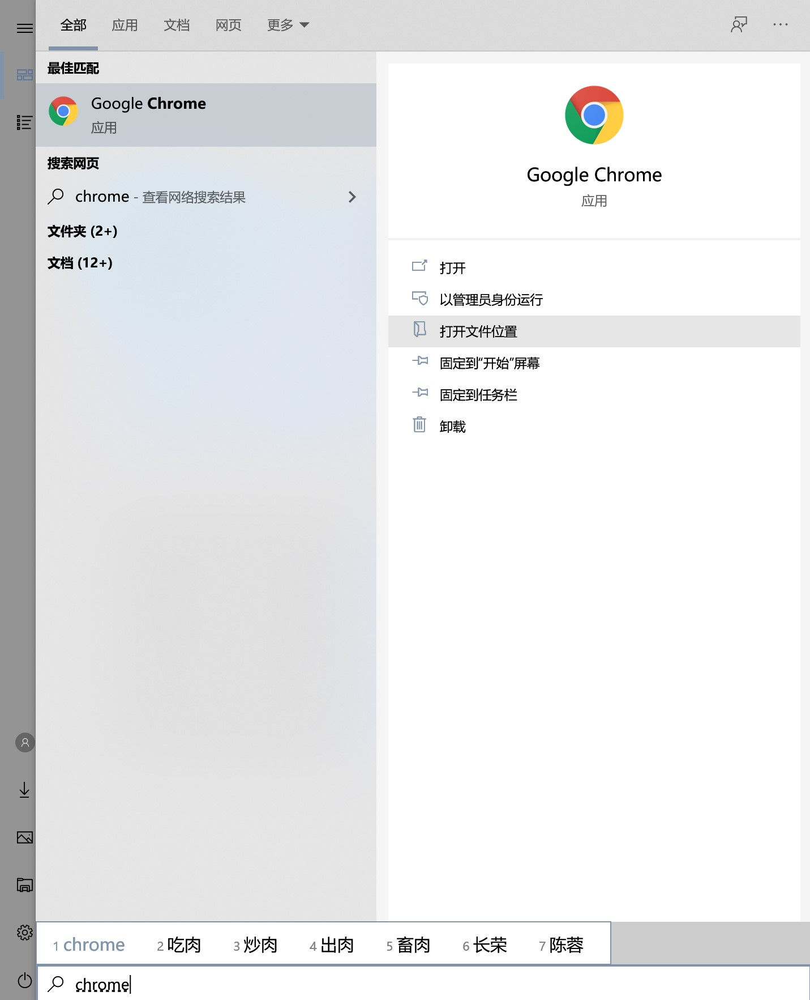
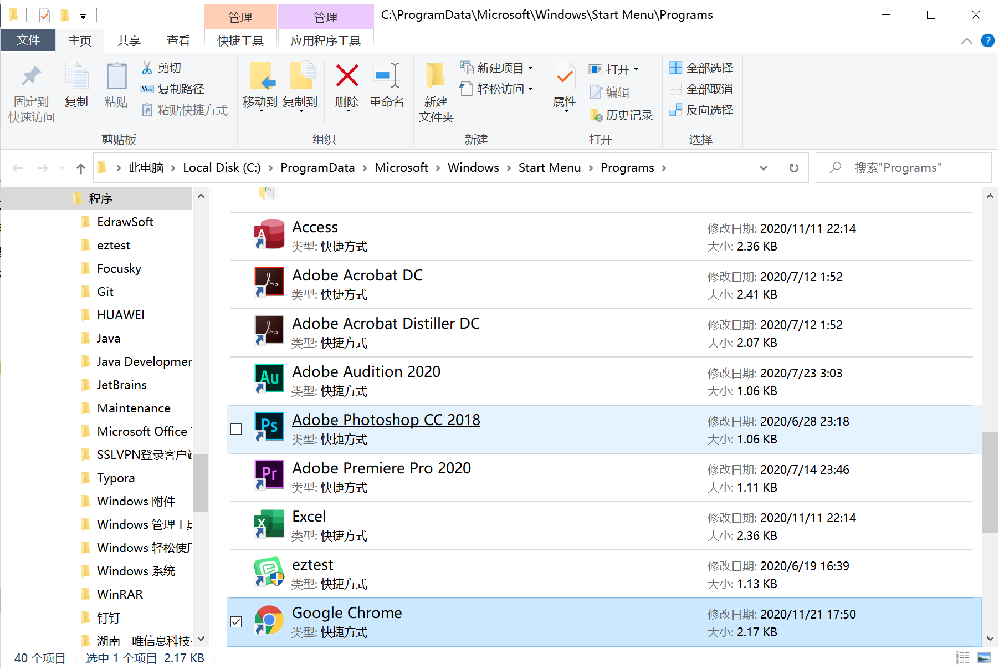
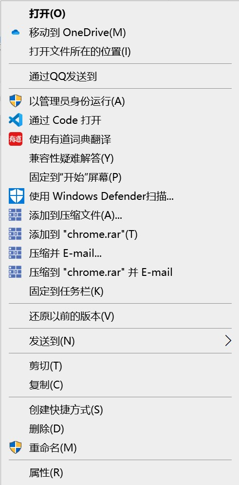
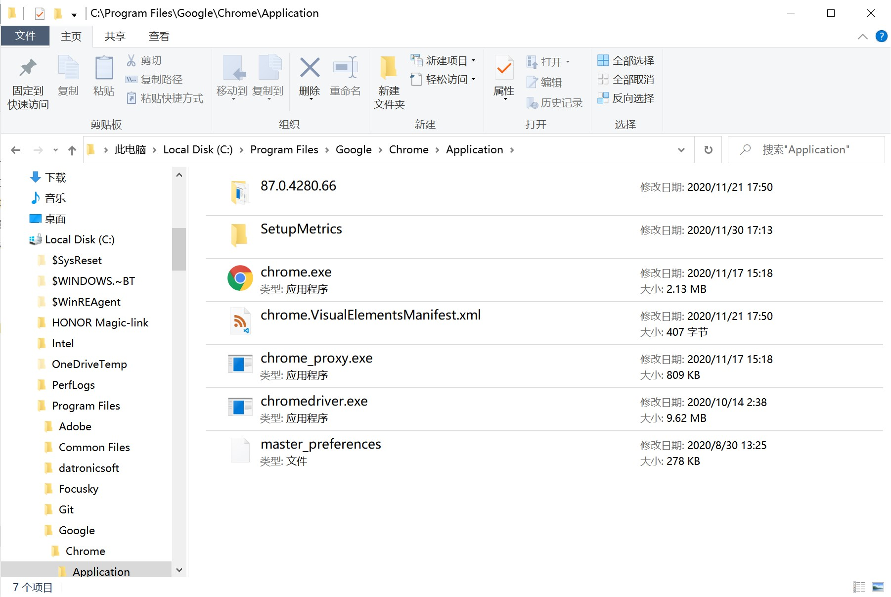
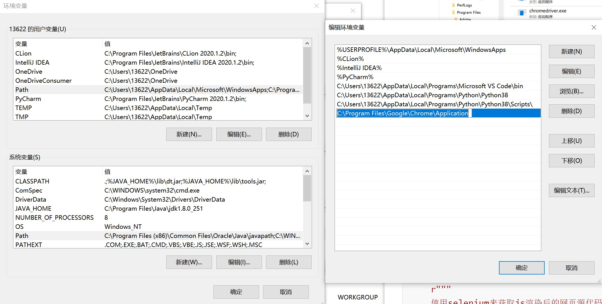

# Python爬虫——爬取js渲染的网站

[[Python3 网络爬虫开发实战\] 7.1-Selenium 的使用 | 静觅 (cuiqingcai.com)](https://cuiqingcai.com/5630.html)

主要使用Selenuim库配合ChromeDriver来获取选浏览器选然后的源代码, 这个方法是通过驱动浏览器, 用电脑模拟人来操作浏览器做到所见即所得, 这很方便, 但也正因如此, 这样会使得爬虫的速度变慢, 需要做好权衡.

### 准备工作

- 安装Chrome浏览器

  略

- [安装ChromeDriver](https://cuiqingcai.com/5135.html)

  1. 在Chrome浏览器地址栏中输入：

     ```
     chrome://settings/help
     ```

     或者点击菜单->帮助->关于Chrome打开关于Chrome页面

  2. 记下版本号:

     ```
     版本 87.0.4280.66（正式版本） （64 位）//这是我的版本号
     ```

  3. 在官网选择合适你Chrome版本号的下载链接, 点击打开镜像下载安装包

     官网下载链接: [Downloads - ChromeDriver - WebDriver for Chrome (chromium.org)](https://chromedriver.chromium.org/downloads)

     >这里是以上版本号的chromedriver安装包, 如果你的版本和我一样, 可以直接使用:
     >
     >[chromedriver_win32.zip](reference\rest\chromedriver_win32.zip) 
     >
     >

  4. 将.zip中的可执行文件解压到Chrome浏览器所在的目录中，可以按照以下方式便捷地找到目录的位置：

     

     点击打开文件位置。

     

     

     右键点击Chrome浏览器的快捷方式，然后选择“打开文件夹所在的位置”

     

     将[chromedriver_win32.zip](reference\rest\chromedriver_win32.zip) (或者你自己下载的安装包)中的可执行文件解压到这个目录之下

     接下来在用户环境变量的`Path`变量中添加这个文件夹的路径

     

     然后点击确定，确定，一直确定下去...

- 安装Selenium

  ```
  pip3 install selenium
  ```

### 最基本使用

由于我们只需要获得js渲染出的网页源代码, 并不需要进行网页交互, 所以这里只介绍最为基本的使用方法, 其他方法在有需求时再去查询.

```python
def get_code_of_rendered_page(url: str) -> str:
    r"""
    使用selenium来获取js渲染后的网页源代码
    :param url: 网页地址
    :return: 网页源代码
    """
    browser = webdriver.Chrome()
    browser.get(url)
    code = browser.page_source
    browser.close()
    return code
```

这是爬虫的`util`包中提供的方法，做好[准备工作](# 准备工作)以后可以调用该方法返回渲染过后的网页代码。